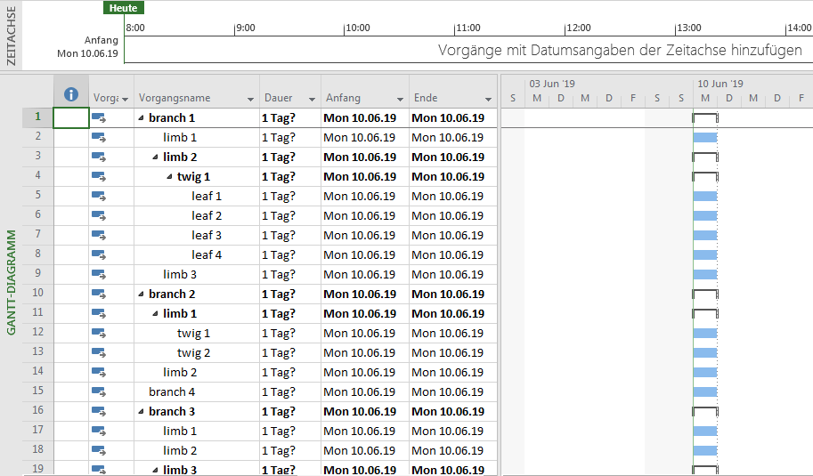

# Freemind to Microsoft Excel converter

Convert Freemind files wit extension .mm (XML file format) to Excel files with extension .xlsx.

Even though that Freemind already has an option to copy/paste text information from a mindmap to Excel, the result looses too much structural information for my needs.

Here is an example mindmap:

This is the result by copy/paste into Excel:

This is the result using freemind_to_excel:

Presently only the nodes text is transferred into the Excel file. All other elements like notes, icons, etc. are skipped.

## Usage

    main.py --excel input_file.mm output_file.xlsx

Presently tested on Win7 only.

# Freemind to Microsoft Project converter

Convert Freemind files wit extension .mm (XML file format) to Project files with extension .XML.

Contrary to the Excel conversion the resulting XML file has to be imported into Project.

This is the result using main.py with the --project option:

Presently only the nodes text and hirarchy is transferred into the Excel file. All other elements like notes, icons, etc. are skipped.

## Usage

    main.py --project input_file.mm output_file.xml.

Presently tested on Win7 only.
