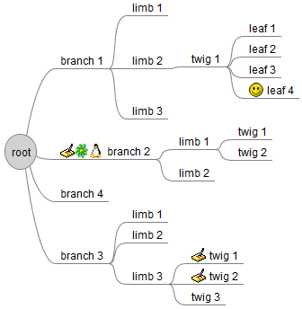
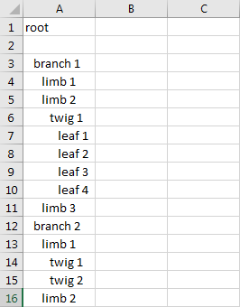
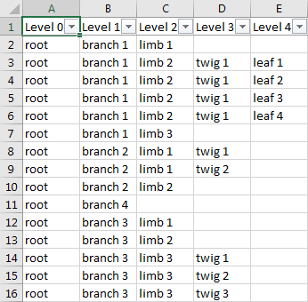

# Freemind to Excel converter

Convert Freemind files wit extension .mm (XML file format) to Excel files with extension .xlsx.

Even though that Freemind already has an option to copy/paste text information from a mindmap to Excel, the result looses too much structural information for my needs.

Here is an example mindmap:

This is the result by copy/paste into Excel:

This is the result using freemind_to_excel:

Presently only the nodes text is transferred into the Excel file. All other elements like notes, icons, etc. are skipped.

## Usage

''''main.py --excel input_file.mm output_file.xlsx''''

Presently tested on Win7 only.
